# P1 数据结构与算法

## 1. 数据结构基础概念

### 1.1 基本术语定义

| 术语         | 定义                                           | 类比说明                 |
| ------------ | ---------------------------------------------- | ------------------------ |
| **数据**     | 对客观事物的一种符号表示（图像、声音等）       | 日常生活中各种信息的载体 |
| **数据元素** | 数据的基本单位                                 | 学生表中的每一条学生记录 |
| **数据项**   | 构成数据元素不可分割的最小单位                 | 学号、姓名、性别         |
| **数据对象** | 具有相同性质的数据元素的集合                   | 全班学生的集合           |
| **数据结构** | 相互之间存在一种或多种特定关系的数据元素的集合 | 由逻辑关系组织起来的数据 |

### 1.2 数据结构的二元组表示

数据结构一般定义为二元组形式：

$$Data\_Structure = (D, S)$$

- **D (Data)**：数据元素的有限集
- **S (Structure)**：数据关系的有限集

> **R 的含义**：在有些表示中使用 R 表示数据关系，即 R 是数据关系的有限集

### 1.3 数据结构的三要素

数据结构由**三部分**组成：

1. **逻辑结构**：数据元素之间的逻辑关系
2. **存储结构**（物理结构）：数据结构在计算机中的表示
3. **数据的运算**：对数据进行的操作

---

## 2. 逻辑结构

### 2.1 逻辑结构分类图

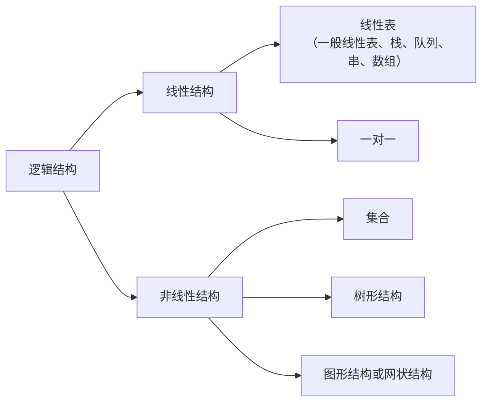

### 2.2 线性结构

特点：数据元素之间是**一对一**的关系

包括：线性表、栈、队列、串、数组

### 2.3 非线性结构

| 结构类型              | 元素关系 | 特点                                   |
| --------------------- | -------- | -------------------------------------- |
| **集合**              | 无       | 数据元素除同属一个集合外，没有其他关系 |
| **树形结构**          | 一对多   | 每个节点与多个节点有连线               |
| **图形结构/网状结构** | 多对多   | 任意节点之间都可能存在连线             |

---

## 3. 存储结构

### 3.1 四种存储结构对比

| 存储类型                 | 定义                               | 特点                   |
| ------------------------ | ---------------------------------- | ---------------------- |
| **顺序存储**             | 逻辑相邻的元素，物理位置也相邻     | 按顺序连续存放         |
| **链式存储**             | 不要求物理相邻，借助指针找下一元素 | 需要存储数据和地址指针 |
| **索引存储**             | 建立索引表，索引项包含关键字和地址 | 通过索引表检索地址     |
| **散列存储（哈希存储）** | 根据散列函数直接计算存储地址       | 地址由散列函数决定     |

### 3.2 顺序存储详解

**核心思想**：逻辑上相邻的元素，在物理位置上也相邻

**类比**：按学号排队，24号排在25号前面 → 物理位置相邻

### 3.3 链式存储详解

**核心思想**：不要求物理相邻，借助元素存储地址的指针找下一个元素

**类比**：游戏连锁任务
- 完成当前任务 → 系统提示下一个任务位置 → 按地址找下一个任务 → 循环

**存储内容**：
- 数据元素本身
- 下一个数据元素的地址（指针）

### 3.4 索引存储详解

**核心思想**：建立索引表，索引项包含关键字和地址

**检索过程**：在索引表中检索关键字 → 找到对应地址 → 根据地址找到数据

### 3.5 散列存储详解

**核心思想**：根据散列函数直接计算存储地址

**公式**：`存储地址 = 散列函数(关键字)`

**别名**：哈希存储（Hash Storage）

---

## 4. 算法基础

### 4.1 算法的定义

算法是对特定问题求解步骤的一种描述，是有限序列的操作步骤。

### 4.2 算法的五大特性

| 特性       | 含义                                               | 注意事项       |
| ---------- | -------------------------------------------------- | -------------- |
| **有穷性** | 算法必须在有穷步骤内完成，每个步骤在有穷时间内完成 | 区别于"健壮性" |
| **确定性** | 每条指令有确切含义，相同输入有相同输出             | 不能有二异性   |
| **可行性** | 算法必须是可执行的                                 | 能被计算机执行 |
| **输入**   | 零个或多个输入                                     | 可以没有输入   |
| **输出**   | 一个或多个输出                                     | 必须有输出     |

> **注意**：考试常考"健壮性不属于算法的特性"，健壮性是算法设计的目标之一。

### 4.3 算法的设计目标

| 目标       | 含义                                             |
| ---------- | ------------------------------------------------ |
| **正确性** | 算法能正确求解问题                               |
| **可读性** | 算法易于理解                                     |
| **健壮性** | 输入非法数据时能适当处理，不会输出莫名其妙的结果 |
| **高效性** | 时间效率高、空间存储量需求小                     |

---

## 5. 时间复杂度

### 5.1 基本概念

| 概念           | 定义                                         |
| -------------- | -------------------------------------------- |
| **频度**       | 一个语句在算法中被重复执行的次数             |
| **时间复杂度** | 语句频度之和的数量级，记作 $T(n) = O(f(n))$ |

### 5.2 大O记号规则

**核心规则**：只保留最高数量级，去除常数和低阶项

**常见数量级排序**（从低到高）：

$\text{常数阶 } O(1) < \text{对数阶 } O(\log n) < \text{线性阶 } O(n) < \text{线性对数阶 } O(n \log n) < \text{平方阶 } O(n^2) < \text{指数阶 } O(2^n) < \text{阶乘阶 } O(n!)$


> **记忆口诀**：常对幂指阶（常数、对数、幂函数、指数、阶乘）

### 5.3 复杂度计算规则

#### 加法规则

两个频度之和相加，取数量级较大的：

$T(n) = T_1(n) + T_2(n) = O(\max(f(n), g(n)))$

#### 乘法规则

两个频度相乘，结果为数量级相乘：

$T(n) = T_1(n) \times T_2(n) = \mathcal{O}(f(n) \times g(n))$

### 5.4 时间复杂度计算示例

#### 示例1：嵌套循环

```c
for(i = 2; i <= n; i++)
    for(j = 1; j < i; j++)
        x = x + 1;
```

**分析过程**：
1. 外层循环：i 从 2 到 n，执行 n-1 次
2. 内层循环：j 从 1 到 i-1
3. 频度之和 = 1 + 2 + 3 + ... + (n-1) = n(n-1)/2
4. 保留最高数量级：n²

**答案**：$T(n) = O(n^2)$

#### 示例2：指数增长循环

```c
i = 1;
while(i <= n)
    i = i * 2;
```

**分析过程**：
1. i 的值变化：1 → 2 → 4 → 8 → 16 → ... → 2^T
2. 循环条件：2^T ≤ n
3. 两边取对数：T ≤ log₂n

**答案**：$T(n) = O(\log_2 n)$

---

## 典型例题汇总

### 题型1：数据结构基础概念

**题目**：以下说法正确的是？
- A. 数据项是数据的基本单位
- B. 数据元素是数据的最小单位
- C. 数据结构是带结构的数据项的集合
- D. 数据元素是由若干个数据项组成

**答案**：D

**解析**：
- 数据项是**最小**单位，不是基本单位 → A 错
- 数据元素是**基本**单位，不是最小单位 → B 错
- 数据结构是数据**元素**的集合，不是数据项 → C 错
- 数据元素由数据项组成 → D 正确

---

### 题型2：数据结构二元组

**题目**：数据的逻辑结构可用二元组表示 `B = (D, S)`，其中 S 是什么的有限集？

**答案**：数据关系（或 R 表示数据关系）

---

### 题型3：线性结构判断

**题目**：以下数据结构中不是线性结构的是？
- A. 栈
- B. 队列
- C. 串
- D. 二叉树

**答案**：D

**解析**：二叉树属于**树形结构**，是**非线性结构**

---

### 题型4：存储结构判断

**题目**：以下与数据的存储结构无关的术语是？
- A. 有序表
- B. 链表的链
- C. 顺序表的顺序
- D. 哈希表

**答案**：A

**解析**：
- "链"、"顺序"、"哈希" 都与存储结构直接相关 → B、C、D 排除
- "有序表" 只描述逻辑关系，存储时可用顺序存储也可用链式存储 → 与存储结构无关

---

### 题型5：算法特性判断

**题目**：以下哪一项不属于算法的特性？
- A. 可行性
- B. 输入
- C. 确定性
- D. 健壮性

**答案**：D

**解析**：
- 健壮性是算法**设计目标**，不是算法的**特性**
- 算法的特性包括：有穷性、确定性、可行性、输入、输出

---

### 题型6：时间复杂度计算

**题目**：设 n 为正整数，则下列程序段的时间复杂度为？

```c
i = 1;
while(i <= n)
    i = i * 2;
```

**答案**：$O(\log_2 n)$

---

## 常见考点速记

### 数据结构二元组
```
Data_Structure = (D, S)
- D = Data，数据元素的有限集
- S = Structure/R，数据关系的有限集
```

### 逻辑结构分类
```
线性结构（一对一）：线性表、栈、队列、串、数组
非线性结构：
  - 集合（无关系）
  - 树形结构（一对多）
  - 图形/网状结构（多对多）
```

### 存储结构四种类型
```
1. 顺序存储：物理相邻
2. 链式存储：指针连接
3. 索引存储：索引表检索
4. 散列/哈希存储：散列函数计算地址
```

### 算法五大特性

`有穷性、确定性、可行性、输入、输出`
（健壮性是设计目标，不是特性）

### 时间复杂度口诀
常对幂指阶
$O(1) < O(\log n) < O(n) < O(n \log n) < O(n^2) < O(2^n) < O(n!)$

---

# P2 顺序表

## 1. 线性表的定义

### 1.1 基本概念

**线性表**是具有相同数据类型的 $N$ 个数据元素的有限序列。

- $N$ 可以取零（空表）
- 用 $L$ 来命名线性表：$L = (a_1, a_2, a_3, \dots, a_i, \dots, a_n)$
- 元素之间有顺序关系

### 1.2 直接前驱与直接后继

- **直接前驱**：$a_{i-1}$ 是 $a_i$ 的直接前驱（$a_i$ 的前面那个元素）
- **直接后继**：$a_{i+1}$ 是 $a_i$ 的直接后继（$a_i$ 的后面那个元素）

### 1.3 重要规律

| 位置 | 规律 |
|------|------|
| 除第一个元素外 | 每个元素有且仅有一个直接前驱 |
| 除最后一个元素外 | 每个元素有且仅有一个直接后继 |

> **注意**：线性表是逻辑结构，顺序表是存储结构，两者不同。

---

## 2. 线性表的基本操作

| 函数名 | 作用 | 是否需要引用(`&`) |
|--------|------|-------------------|
| `InitList(&L)` | 初始化表，构造空表 | 需要（改变表结构） |
| `Length(L)` | 求表长，返回元素个数 | 不需要 |
| `LocateElem(L, e)` | 按值查找，返回元素位序 | 不需要 |
| `GetElem(L, i)` | 按位查找，返回第 $i$ 个元素的值 | 不需要 |
| `ListInsert(&L, i, e)` | 在第 $i$ 个位置插入值为 $e$ 的元素 | 需要（改变表结构） |
| `ListDelete(&L, i, &e)` | 删除第 $i$ 个元素，用 $e$ 返回其值 | 需要（改变表+返回值） |
| `PrintList(L)` | 输出表 | 不需要 |
| `Empty(L)` | 判断表是否为空 | 不需要 |
| `DestroyList(&L)` | 销毁表，释放内存空间 | 需要 |

### 2.1 引用符号的使用规则

- 如果操作会**改变表的结构**（长度、内容）：需要 `&`
- 如果操作只是**读取/查询**：不需要 `&`

---

## 3. 顺序表的结构

### 3.1 什么是顺序表

**顺序表**：顺序存储的线性表。顺序存储的核心：逻辑上相邻的两个元素，物理位置上也相邻。

> **记忆方法**：顺序表 ≈ 数组

### 3.2 地址计算公式

**前提条件**：
- 数组下标从 **0** 开始
- 元素下标从 **1** 开始

**核心公式**：

$LOC(a_i) = LOC(a_1) + (i-1) \times \text{sizeof(ElemType)}$

| 数组下标 | 元素 | 元素下标 | 地址计算 |
|----------|------|----------|----------|
| 0 | $a_1$ | 1 | $LOC(a_1)$ = 首地址 |
| 1 | $a_2$ | 2 | $LOC(a_2) = LOC(a_1) + 1 \times \text{sizeof}$ |
| $i-1$ | $a_i$ | $i$ | $LOC(a_i) = LOC(a_1) + (i-1) \times \text{sizeof}$ |

> **必背公式**：$LOC(a_i) = LOC(a_1) + (i-1) \times \text{sizeof(元素类型)}$

### 3.3 顺序表的类型描述

#### 静态分配

```c
#define MaxSize 50  // 定义最大容量

typedef struct {
    ElemType data[MaxSize];  // 数组存储数据元素
    int length;              // 当前长度
} SqList;
```

**缺点**：数组大小固定，如果超出会导致溢出和程序崩溃。

#### 动态分配

```c
#define InitSize 100  // 初始表长

typedef struct {
    ElemType *data;      // 动态分配数组指针
    int MaxSize;         // 最大容量
    int length;          // 当前长度
} SeqList;
```

**动态分配语句**：

```c
L.data = (ElemType *)malloc(sizeof(ElemType) * InitSize);
```

> **注意**：动态分配是开辟一块**更大的新空间**替换旧空间，而不是在原空间上扩充。

---

## 4. 顺序表的特点

### 4.1 三大特点对比

| 特点 | 说明 |
|------|------|
| **随机存取** | 通过首地址和元素下标，可在 $O(1)$ 时间内找到任意元素 |
| **存储密度高** | 每个节点只存储数据元素（相对于链表还需存储指针） |
| **插入删除效率低** | 逻辑相邻的元素物理位置也相邻，插入/删除需移动大量元素 |

### 4.2 时间复杂度总结

| 操作 | 时间复杂度 |
|------|------------|
| 按位查找/访问任意元素 | $O(1)$ |
| 插入 | $O(n)$ |
| 删除 | $O(n)$ |
| 按值查找 | $O(n)$ |

> **核心结论**：顺序表**擅长访问**（随机存取），**不擅长插入删除**。

---

## 5. 顺序表的实现

### 5.1 插入操作

**规律**：从后往前移动，先移动最后一个，再移动倒数第二个...直到第 $i$ 个位置后的元素全部后移一位。

```c
bool ListInsert(&L, i, e) {
    // 判断插入位置是否合法 (1 ≤ i ≤ length+1)
    if (i < 1 || i > L.length + 1)
        return false;
    
    // 从后往前移动元素
    for (j = L.length; j >= i; j--) {
        L.data[j] = L.data[j-1];  // 后移一位
    }
    
    // 插入新元素
    L.data[i-1] = e;  // 第i个位置对应数组下标i-1
    
    // 表长加1
    L.length++;
    
    return true;
}
```

> **注意**：数组下标 = 元素位置 - 1

#### 插入时间复杂度分析

| 情况 | 移动元素个数 | 说明 |
|------|-------------|------|
| 最好情况 | $0$ | 在表尾插入（$i = n+1$） |
| 最坏情况 | $n$ | 在表头插入（$i = 1$） |
| 平均情况 | $n/2$ | 元素位置从1到n+1的期望 |

**平均时间复杂度**：$O(n)$

### 5.2 删除操作

**规律**：将第 $i+1$ 个元素到第 $n$ 个元素**依次前移一位**。

```c
bool ListDelete(&L, i, &e) {
    // 判断删除位置是否合法 (1 ≤ i ≤ length)
    if (i < 1 || i > L.length)
        return false;
    
    // 用e返回被删元素的值
    e = L.data[i-1];
    
    // 从前往后移动元素
    for (j = i; j < L.length; j++) {
        L.data[j-1] = L.data[j];  // 前移一位
    }
    
    // 表长减1
    L.length--;
    
    return true;
}
```

#### 删除时间复杂度分析

| 情况 | 移动元素个数 | 说明 |
|------|-------------|------|
| 最好情况 | $0$ | 删除表尾元素 |
| 最坏情况 | $n-1$ | 删除表头元素 |
| 平均情况 | $(n-1)/2$ | 随机位置删除 |

**平均时间复杂度**：$O(n)$

### 5.3 按值查找

```c
int LocateElem(L, e) {
    for (i = 0; i < L.length; i++) {
        if (L.data[i] == e)
            return i + 1;  // 返回位序(从1开始)
    }
    return 0;  // 未找到
}
```

**时间复杂度**：$O(n)$

### 5.4 按位查找

```c
ElemType GetElem(L, i) {
    if (i < 1 || i > L.length)
        return 0;  // 位置不合法
    return L.data[i-1];  // 返回第i个元素
}
```

**时间复杂度**：$O(1)$ —— 这是顺序表随机存取优势的体现

### 5.5 两个有序顺序表合并（双指针法）

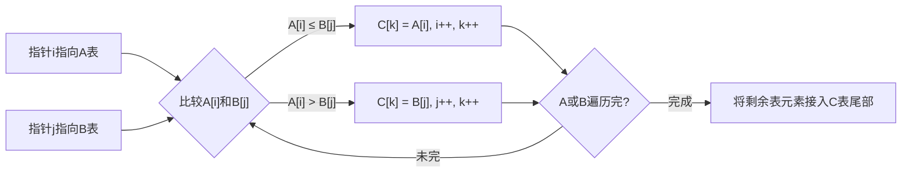

```c
bool MergeList(SqList A, SqList B, SqList &C) {
    if (C.MaxSize < A.length + B.length)
        return false;
    
    int i = 0, j = 0, k = 0;
    
    while (i < A.length && j < B.length) {
        if (A.data[i] <= B.data[j]) {
            C.data[k++] = A.data[i++];
        } else {
            C.data[k++] = B.data[j++];
        }
    }
    
    while (i < A.length) C.data[k++] = A.data[i++];
    while (j < B.length) C.data[k++] = B.data[j++];
    
    C.length = k;
    return true;
}
```

> **关键点**：使用双指针遍历两个有序表，时间复杂度 $O(n+m)$

---

## 典型例题汇总

### 题型1：地址计算

**题目**：顺序表中第一个元素的存储地址为 $1000$，每个元素占据 $4$ 个地址单元，求第 $6$ 个元素的存储地址。

**解**：代入公式 $LOC(a_i) = LOC(a_1) + (i-1) \times \text{sizeof}$

$LOC(a_6) = 1000 + (6-1) \times 4 = 1000 + 20 = 1020$

**答案**：$1020$

---

### 题型2：插入元素移动次数

**题目**：在长度为 $N$ 的顺序表的第 $i$ 位置插入一个元素，需要移动多少个元素？

**分析**：
- 第 $i$ 个位置之前的元素：**不需要移动**
- 第 $i$ 个位置之后的元素（从第 $i$ 个到第 $N$ 个）：**需要后移**

**答案**：需要移动 $N - i + 1$ 个元素

---

### 题型3：删除元素移动次数

**题目**：顺序表中有 $N$ 个数据元素，删除表中第 $X$ 个元素需要移动多少个元素？

**答案**：需要移动 $N - X$ 个元素

---

### 题型4：时间复杂度判断

**题目**：顺序存储的线性表，访问节点和增加/删除节点的时间复杂度分别是？

| 操作 | 时间复杂度 |
|------|------------|
| 访问节点 | $O(1)$ |
| 增加节点 | $O(n)$ |
| 删除节点 | $O(n)$ |

---

## 常见考点速记

### 顺序表核心公式

```
地址公式：LOC(a_i) = LOC(a_1) + (i-1) × sizeof
插入移动：N - i + 1 个元素（从后往前移）
删除移动：N - i 个元素（从前往后移）
```

### 顺序表特点速记

```
优势：随机存取 O(1)，存储密度高
劣势：插入删除 O(n)，需移动大量元素
```

---

# P3 链表

## 1. 单链表的概念与结构

### 1.1 什么是单链表

**单链表**是指**链式存储的线性表**。每个节点分为两部分：

| 域 | 作用 |
|---|------|
| **data 域** | 存放数据元素自身的信息 |
| **next 指针域** | 存放后继节点的地址 |

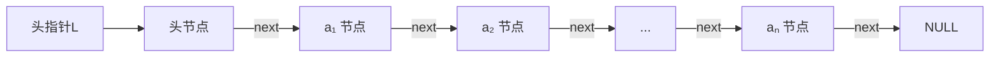

### 1.2 节点类型描述

```c
typedef struct LNode {
    ElemType data;      // 数据域
    struct LNode *next; // 指针域，指向后继节点
} LNode, *LinkList;
```

> **命名区别**：`LNode` 强调节点本身，`LinkList` 强调整个链表

### 1.3 头节点

在单链表的第一个元素节点之前附加的节点称为**头节点**。

- 头节点的 data 域通常不存放任何信息
- 头指针 $L$ 指向头节点

**增加头节点的目的**：方便运算的实现

- 不带头节点时，第一个元素节点和后续节点需要**分类讨论**，操作麻烦
- 带头节点后，所有节点（包括第一个元素节点）都有前驱节点，操作统一

> **重要**：题目中是否带头节点，操作方式完全不同！

### 1.4 单链表与顺序存储的区别

| 特性 | 链式存储 | 顺序存储 |
|------|---------|---------|
| 元素地址 | 不一定连续 | 必须连续 |
| 插入/删除 | 只需修改指针，不移动元素 | 需要移动大量元素 |

---

## 2. 单链表的基本操作

> **前提**：以下操作均针对**带头节点**的单链表

### 2.1 按序号查找节点值 GetElem

**功能**：在单链表 $L$ 中查找第 $i$ 个节点，找到返回该节点，否则返回 `NULL`

```c
LNode *GetElem(LinkList L, int i) {
    LNode *p;
    int j = 1;
    p = L->next;     // 指向第一个元素节点
    
    while (p && j < i) {
        p = p->next;
        j++;
    }
    return p;
}
```

**时间复杂度**：$O(n)$

**易错点**：
- `j < i` 而不是 `j <= i`
- $i = 0$ 时表示头节点，直接返回 $L$
- $i < 0$ 时返回 `NULL`（不合法）

### 2.2 按值查找节点 LocateElem

```c
LNode *LocateElem(LinkList L, ElemType e) {
    LNode *p;
    p = L->next;
    
    while (p && p->data != e) {
        p = p->next;
    }
    return p;
}
```

**时间复杂度**：$O(n)$

### 2.3 插入节点

**算法步骤**：
1. 找到第 $i-1$ 个节点（插入位置的前驱节点），设为 $p$
2. 创建新节点 $s$，将 $s$ 的 `next` 指向 $p$ 的后继节点
3. 将 $p$ 的 `next` 指向 $s$

**关键代码**：

```c
s->next = p->next;   // ① 让新节点的next指向p原来的后继
p->next = s;         // ② 让p的next指向新节点s
```

> **注意顺序**：必须先执行①再执行②，否则会丢失 $p$ 原来的后继节点地址

**前插操作技巧**：可以将前插转换为后插 + 数据域交换

```c
// 在p节点之前插入s
s->next = p->next;
p->next = s;
swap(&s->data, &p->data);  // 交换数据域
```

### 2.4 删除节点

**算法步骤**：
1. 找到第 $i-1$ 个节点，设为 $p$
2. 用指针 $q$ 指向待删除节点（即 $p\text{->next}$）
3. 修改指针：$p\text{->next} = q\text{->next}$
4. 释放节点 $q$

```c
LNode *q = p->next;       // ① 用q记录待删除节点
p->next = q->next;        // ② p的next指向q的后继
free(q);                   // ③ 释放被删除节点
```

---

## 3. 双链表

### 3.1 双链表的概念与结构

与单链表的区别：每个节点有**两个指针域**：
- `prior`：指向前驱节点
- `next`：指向后继节点

```c
typedef struct DNode {
    ElemType data;
    struct DNode *prior;   // 前驱指针
    struct DNode *next;    // 后继指针
} DNode, *DLinkList;
```

### 3.2 双链表的插入操作

在双链表 $p$ 节点后面插入新节点 $s$（共4行，注意顺序）：

```c
s->next = p->next;          // ① s的后继指向p原来的后继
p->next->prior = s;         // ② p原后继的前驱指向s
s->prior = p;               // ③ s的前驱指向p
p->next = s;                // ④ p的后继指向s
```

> **顺序要求**：第①、②行必须在第④行之前执行。正确顺序：`① → ② → ③ → ④`

### 3.3 双链表的删除操作

删除双链表 $p$ 的后继节点 $q$：

```c
q = p->next;              // ① q指向待删除节点
p->next = q->next;        // ② p的后继指向q的后继
q->next->prior = p;       // ③ q后继节点的前驱指向p
free(q);                   // ④ 释放q
```

---

## 4. 循环链表

### 4.1 循环单链表

**特点**：
- 表尾节点的 `next` 指针指向**头节点**（而非 `NULL`）
- 形成一个环

**判空条件**：$L\text{->next} = L$（头节点的 next 指向自身）

### 4.2 循环双链表

**特点**：
- 表尾节点的 `next` 指向头节点
- 头节点的 `prior` 指向表尾节点
- 形成一个双向环

**判空条件**：`head->next == head && head->prior == head`

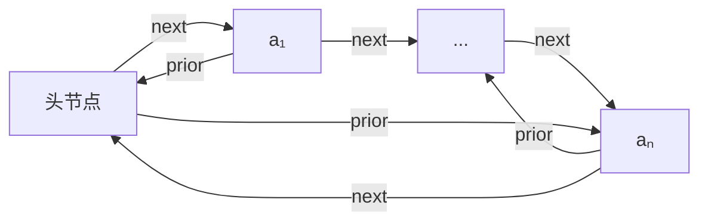

---

## 典型例题汇总

### 题型1：存储地址连续性

**题目**：信息表采用链式存储，问表中各元素的存储地址之间的关系

**答案**：**不连续**

**解析**：链式存储通过指针域链接各节点，节点在内存中可以分散存放，地址**不要求连续**。

---

### 题型2：头节点的作用

**题目**：单链表中增加一个头节点的目的是什么？

**答案**：**方便运算的实现**

---

### 题型3：查找成功的平均比较次数

**题目**：在含有 $n$ 个节点的单链表中查找值为 $x$ 的节点，查找成功时的平均比较次数是？

**答案**：$\dfrac{n+1}{2}$

**解析**：$\text{平均次数} = \frac{1 + 2 + \dots + n}{n} = \frac{n(n+1)}{2n} = \frac{n+1}{2}$

---

### 题型4：循环链表判断

**题目**：循环链表中每个元素都有后继

**答案**：**正确**（表尾指向表头）

---

### 题型5：存储结构选择

**题目**：下列说法正确的是？

| 选项 | 内容 |
|------|------|
| A | 链式存储比顺序存储更优 |
| B | 顺序存储适合频繁插入和删除 |
| C | 链式存储适合频繁插入和删除 |
| D | 顺序存储比链式存储更优 |

**答案**：**C**

---

## 常见考点速记

### 链表操作核心

```
插入：先连后继(s->next = p->next)，再连前驱(p->next = s)
删除：先记录(q = p->next)，再跨接(p->next = q->next)，最后释放(free(q))
双链表插入：①→②→③→④（①必须在④之前）
```

### 链表分类速记

```
单链表：data + next
双链表：data + prior + next
循环单链表：尾next → 头
循环双链表：尾next → 头，头prior → 尾
```

---

# P4 栈和队列

## 1. 栈的基本概念

### 1.1 栈的定义

**栈（Stack）**：只允许在一端进行插入或删除操作的线性表。

| 术语 | 含义 |
|------|------|
| 栈顶（Top） | 允许插入和删除的一端 |
| 栈底（Bottom） | 不允许操作的一端 |
| 入栈（Push） | 向栈顶插入元素的操作 |
| 出栈（Pop） | 从栈顶删除元素的操作 |
| 空栈 | 不含任何元素的空表 |

### 1.2 栈的特性

**先进后出（FILO - First In Last Out）**

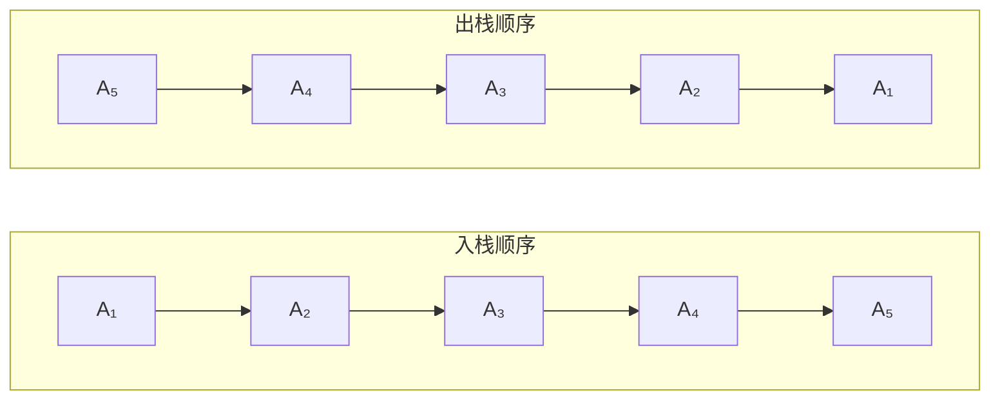

**结论**：入栈顺序与出栈顺序**相反**。

### 1.3 基本操作代码

```c
// 进栈操作（Push）
int Push(SqStack &S, ElemType x) {
    if (S.top == MaxSize - 1)  // 先判断栈是否已满
        return ERROR;
    S.data[++S.top] = x;       // top指针先加1，再存入数据
    return OK;
}

// 出栈操作（Pop）
int Pop(SqStack &S, ElemType &x) {
    if (S.top == -1)           // 先判断栈是否为空
        return ERROR;
    x = S.data[S.top--];       // 先取出数据，top指针再减1
    return OK;
}
```

> **注意**：进栈操作是先移动指针再送值，出栈操作是先取元素再移动指针

### 1.4 卡特兰数（出栈序列排列数）

$N$ 个不同的元素进栈，出栈元素不同的排列个数为：

$$f(n) = \frac{1}{n+1} \times C_{2n}^{n}$$

其中 $C_{2n}^{n} = \frac{(2n)!}{n! \times n!}$

| $n$ | $f(n)$ |
|-----|--------|
| 1 | 1 |
| 2 | 2 |
| 3 | 5 |
| 4 | 14 |
| 5 | 42 |

**例题**：进站序列为ABC，可能得到的出栈不同排列个数是多少？

$f(3) = \frac{1}{3+1} \times C_{6}^{3} = \frac{1}{4} \times 20 = 5$

---

## 2. 栈的存储结构

### 2.1 顺序栈

#### 类型描述

```c
#define MaxSize 100  // 栈的最大容量

typedef struct {
    ElemType data[MaxSize];  // 存放栈中的元素
    int top;                  // 栈顶指针
} SqStack;
```

> **说明**：top指针不是C语言中的地址指针，可以近似理解为数组下标

#### 基本操作

**初始化**：

```c
void InitStack(SqStack &S) {
    S.top = -1;  // 空栈时top = -1
}
```

**判空**：

```c
bool StackEmpty(SqStack S) {
    if (S.top == -1)
        return true;   // 栈空
    else
        return false;  // 栈非空
}
```

**进栈**：

```c
bool Push(SqStack &S, ElemType x) {
    if (S.top == MaxSize - 1)  // 判断栈是否已满
        return false;
    S.data[++S.top] = x;       // 顺序：先移动指针，再存入数据
    return true;
}
```

**出栈**：

```c
bool Pop(SqStack &S, ElemType &x) {
    if (S.top == -1)          // 判断栈是否为空
        return false;
    x = S.data[S.top--];      // 顺序：先取出栈顶元素，再移动指针
    return true;
}
```

### 2.2 出栈序列合法性判断

**判断方法**：逐个处理输出序列中的元素，手动模拟栈的进栈出栈操作。

**例题**：若进栈序列为 $1,2,3,4,5$，则下列哪个不可能是输出序列？

| 选项 | 模拟过程 | 结果 |
|------|----------|------|
| A $(4,5,3,2,1)$ | 入1234→出4→入5→出5...无法得到3 | 不可能 |
| B $(5,4,3,2,1)$ | 入12345→出5→出4→出3→出2→出1 | 可能 |
| C $(4,3,5,2,1)$ | 入1234→出4→出3→入5→出5→出2→出1 | 可能 |
| D $(1,2,3,4,5)$ | 入1→出1→入2→出2→入3→出3→入4→出4→入5→出5 | 可能 |

**答案**：A

---

## 3. 队列的基本概念

### 3.1 队列的定义

**队列（Queue）**：只允许在一端插入、在另一端删除的线性表。

| 术语 | 含义 |
|------|------|
| 队头（Front） | 允许删除的一端 |
| 队尾（Rear） | 允许插入的一端 |
| 入队 | 在队尾插入元素 |
| 出队 | 在队头删除元素 |

### 3.2 队列的特性

**先进先出（FIFO - First In First Out）**

### 3.3 栈与队列对比

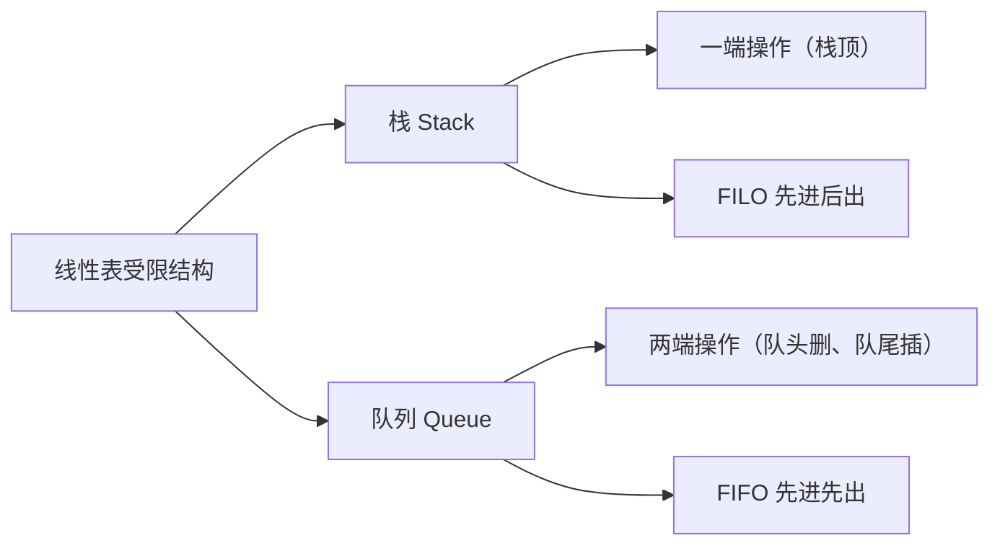

---

## 典型例题汇总

### 题型1：概念题

**题目**：限定仅在表尾进行插入或删除操作的线性表称为什么？

**答案**：**栈**

---

### 题型2：卡特兰数计算

**题目**：进栈序列为ABC，出栈序列排列数为？

**答案**：$f(3) = 5$

---

### 题型3：出栈序列合法性判断

**题目**：手动模拟出栈序列，判断是否可能

---

## 常见考点速记

### 栈的核心要点

```
特性：先进后出 LIFO
空栈：top = -1
进栈：先++再赋值  S.data[++S.top] = x
出栈：先赋值再--  x = S.data[S.top--]
卡特兰数：f(n) = (1/(n+1)) × C(2n, n)
```

### 栈与队列对比记忆

```
栈是"吃了吐"（先进后出）
队列是"吃了拉"（先进先出）

---

# P5 串

## 1. 串的基本概念

### 1.1 串的定义

**串（String）**：由零个或多个字符组成的有限序列。

$S = \text{'A}_1\text{A}_2\text{A}_3\dots\text{A}_n\text{'} \quad (n \geq 0)$

- $S$ 是串名
- 单引号括起来的字符序列是串的值

### 1.2 串的长度

**长度**：串中字符的个数，记作 $|S|$ 或 $\text{len}(S)$

- **空串**：$n = 0$，即串中没有任何字符
- 空格也计入长度

### 1.3 子串

**子串**：串中任意一个**连续的**字符组成的子序列

> **强调**：必须连续！

**例题**：设串 $T = \text{"data"}$，$S = \text{"stringdata"}$，判断 $T$ 是否为 $S$ 的子串？

**答**：是（data 在 stringdata 中是连续子序列）

### 1.4 位置

| 概念 | 定义 |
|------|------|
| 字符在串中的位置 | 该字符在串中的序号（下标从1开始） |
| 子串在主串中的位置 | 子串的第一个字符在主串中的位置 |

### 1.5 串相等

两个串相等需同时满足：
1. 长度相等
2. 每个对应位置的字符都相等

### 1.6 空格串 vs 空串

| 概念 | 定义 |
|------|------|
| 空格串 | 由一个或多个空格组成的串 |
| 空串 | 长度为0，没有任何字符的串 |

> 考试常考：空格串 ≠ 空串

### 1.7 串与线性表的关系

**串是一种特殊的线性表**，特殊性体现在：数据元素只能是**单个字符**。

---

## 2. 串的基本操作

| 函数 | 含义 | 说明 |
|------|------|------|
| `StrCopy(&T, S)` | 复制 | 将串 S 复制给串 T |
| `StrEmpty(S)` | 判空 | 判断串 S 是否为空 |
| `StrCompare(T, S)` | 比较 | 比较两个串 T 和 S 的大小 |
| `StrLength(S)` | 求长度 | 返回串 S 的长度 |
| `SubString(&Sub, S, pos, len)` | 求子串 | 从串 S 的第 pos 个字符起，取长度为 len 的子串赋给 Sub |
| `Concat(&T, S1, S2)` | 连接 | 将 S1 和 S2 连接成新串 T |
| `Index(S, T, pos)` | 定位 | 在主串 S 中从 pos 位置起查找子串 T，返回首次出现的位置 |

---

## 3. 串的简单模式匹配算法（BF算法）

### 3.1 模式匹配的定义

**子串的定位操作**：求子串在主串中的位置

### 3.2 BF算法思想

暴力匹配：从主串的第一个字符开始，依次与子串的每个字符比较。

### 3.3 算法代码

```c
int Index(SString S, SString T, int pos) {
    int i = pos;      // 主串当前匹配位置
    int j = 1;        // 子串当前位置
    while (i <= S.length && j <= T.length) {
        if (S.ch[i] == T.ch[j]) {
            i++;      // 继续比较下一个字符
            j++;
        } else {
            i = i - j + 2;  // 主串回退到下一个起始位置
            j = 1;          // 子串回退到第一个字符
        }
    }
    if (j > T.length)
        return i - T.length;  // 匹配成功
    else
        return 0;             // 匹配失败
}
```

### 3.4 时间复杂度

| 情况 | 复杂度 |
|------|--------|
| 最好情况 | $O(1)$ |
| 最坏情况 | $O(n \times m)$ |
| 平均情况 | $O(n \times m)$ |

---

## 4. 矩阵的压缩存储

### 4.1 压缩存储的定义

**压缩存储**：为多个值相同的元素只分配一个存储空间，对零元素不分配空间。

**目的**：节省存储空间

### 4.2 特殊矩阵分类

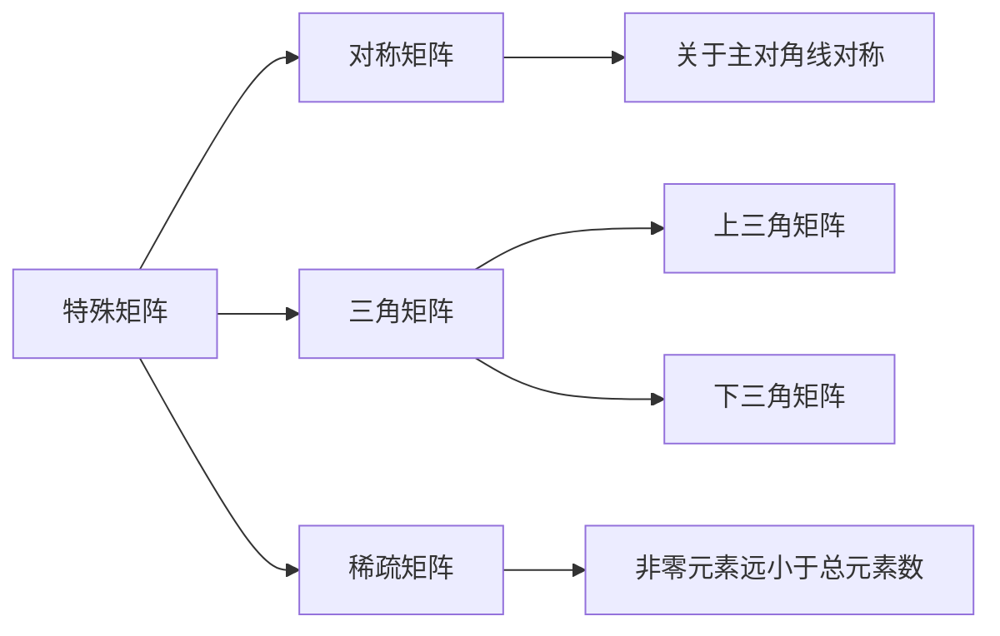

### 4.3 对称矩阵的压缩存储

**存储策略**：对于 $n$ 阶对称矩阵，只存储**主对角线和下三角区**的元素。

**存储方式**：按**行优先**顺序存储到一维数组 $B$ 中。

总元素数 $= 1 + 2 + 3 + \dots + n = \frac{n(n+1)}{2}$

**下标映射公式**：

| 条件 | $A[i][j]$ 在 $B$ 中的下标 $k$ |
|------|-------------------------------|
| $i \geq j$（下三角/主对角线） | $k = \frac{i(i-1)}{2} + j - 1$ |
| $i < j$（上三角） | $k = \frac{j(j-1)}{2} + i - 1$ |

### 4.4 三角矩阵的压缩存储

#### 上三角矩阵

下三角区（不含主对角线）元素全部相同（设为常量 $C$）

存储：上三角区 + 主对角线的元素 + 末尾一个常量 $C$

#### 下三角矩阵

上三角区（不含主对角线）元素全部相同（设为常量 $C$）

存储：下三角区 + 主对角线的元素 + 末尾一个常量 $C$

### 4.5 稀疏矩阵的压缩存储

**稀疏矩阵**：矩阵中非零元素的个数远远小于矩阵元素总个数

#### 三元组法

将每个非零元素表示为一个**三元组**：$(i, j, a[i][j])$

```c
#define MAXSIZE 1000

typedef struct {
    int i, j;        // 行下标，列下标
    ElemType e;
} Triple;

typedef struct {
    Triple data[MAXSIZE + 1];  // 三元组表
    int mu, nu, tu;            // 矩阵行数、列数、非零元素个数
} TSMatrix;
```

#### 十字链表法

除了三元组法，还可以使用**十字链表法**存储稀疏矩阵。

---

## 典型例题汇总

### 题型1：子串连续性

**题目**：串中任意一个字符组成的子序列称为该串的子串。

**答案**：错误（子串必须是**连续**的字符序列）

---

### 题型2：串与线性表关系

**题目**：从数据结构来看，串是一种特殊的线性表，它的特殊性体现在？

**答案**：数据元素只能是一个字符

---

### 题型3：稀疏矩阵存储

**题目**：稀疏矩阵一般的存储方法有？

**答案**：三元组表和十字链表

---

## 常见考点速记

### 串核心概念

```
子串：必须连续
串相等：长度相等 + 对应位置字符相等
空串 ≠ 空格串
模式匹配 BF算法：O(n×m)
```

### 矩阵压缩存储核心公式

```
对称矩阵存储元素数：n(n+1)/2
下三角下标：k = i(i-1)/2 + j - 1
上三角下标（对称矩阵）：k = j(j-1)/2 + i - 1
稀疏矩阵：三元组法 (i, j, value)
```

---

# P6 树和二叉树（1）

## 1. 树的基本概念

### 1.1 树的定义

树是 $N$ 个节点的有限集，记作 $T$。

- 当 $N = 0$ 时，称为**空树**
- 当 $N > 0$ 时，树是**递归定义**的

**树的特性：**
- 有且仅有一个特定的**根结点**
- 根结点没有前驱，只有后继
- 除了根结点以外的所有节点有**且仅有一个前驱**
- 所有节点可以有 **零个或多个后继**

### 1.2 基本术语

| 术语 | 定义 |
|------|------|
| **祖先** | 从根结点到该节点路径上经过的所有节点 |
| **双亲** | 路径上最接近该节点的祖先 |
| **孩子** | 该节点的直接后继 |
| **节点的度** | 该节点拥有的孩子个数 |
| **树的度** | 树中所有节点的最大度数 |
| **分支节点** | 度 $>0$ 的节点（非终端节点） |
| **叶子节点** | 度 $=0$ 的节点（终端节点） |
| **兄弟节点** | 具有相同双亲的节点 |
| **深度** | 从根结点开始自顶向下逐层累加（根为第1层） |
| **高度** | 从最下层开始自底向上逐层累加 |
| **有序树** | 节点的子树从左到右有次序，不能互换 |
| **路径长度** | 路径上所经过的边的条数 |

### 1.3 树的性质

#### 性质一：节点数与度数的关系

$\text{树中的节点数} = \text{所有节点的度数之和} + 1$

**推导**：根结点不能作为任何一个节点的孩子，所有节点的度数之和等于除根结点外的节点总数。

#### 性质二：度为m的树的层节点数上限

$\text{度为 }m\text{ 的树中，第 }i\text{ 层上至多有 } m^{i-1} \text{ 个节点}$

#### 性质三：高度为H的m叉树的节点数上限

$\text{高度为 }H\text{ 的 }m\text{ 叉树至多有 } \frac{m^H - 1}{m - 1} \text{ 个节点}$

**推导**：等比数列求和 $S = 1 + m + m^2 + \dots + m^{H-1} = \frac{m^H - 1}{m - 1}$

#### 性质四：具有N个节点的m叉树的最小高度

$H = \lceil \log_m(N(m-1) + 1) \rceil$

### 1.4 典型例题

#### 例题：节点数与度数

**题目**：设有一棵度为3的树中有两个度数为1的节点，两个度数为2的节点，两个度数为3的节点，求度数为0的节点个数。

**解**：设度数为0的节点个数为 $X$

$\text{节点总数} = \text{度数之和} + 1$

$(2 + 2 + 2 + X) = (2 \times 1 + 2 \times 2 + 2 \times 3) + 1$

$6 + X = 2 + 4 + 6 + 1 = 13$

$X = 7$

**答案**：7个

---

## 2. 二叉树

### 2.1 二叉树的定义

二叉树是 $N$ 个节点的有限集合：
1. 为一棵**空二叉树**
2. 由一个根结点和**两棵互不相交**的左子树、右子树组成

**特点**：
- 二叉树是**递归定义**的
- 二叉树中每个节点**最多有两个孩子**（度 $\leq 2$）
- 左右子树是严格区分顺序的

### 2.2 特殊的二叉树

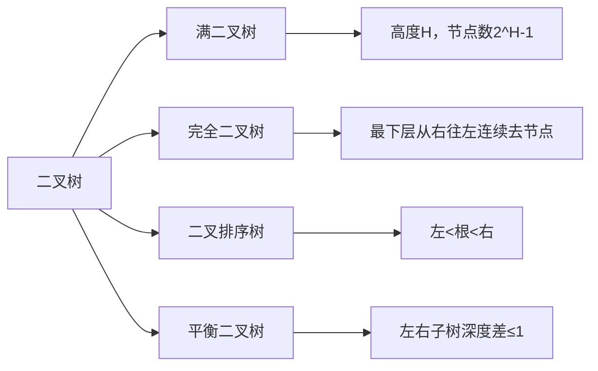

#### （1）满二叉树

**定义**：高度为 $H$ 的二叉树，含有 $2^H - 1$ 个节点。

**节点编号规则**（从1开始，从上到下、从左到右）：

- 双亲节点：$\lfloor I/2 \rfloor$
- 左孩子：$2I$
- 右孩子：$2I + 1$

#### （2）完全二叉树

**定义**：在满二叉树的基础上，最下面一层**从右往左**连续去掉若干节点。

**特点**：
- 叶子节点只在**层次最大的两层**出现
- **度为1的节点最多只有一个**（且只有左孩子，没有右孩子）
- 如果 $I \leq \lfloor N/2 \rfloor$，则节点 $I$ 为分支节点

#### （3）二叉排序树（BST）

- 左子树上的所有关键字 **< 根节点关键字**
- 右子树上的所有关键字 **> 根节点关键字**
- 每棵子树都满足同样的性质

#### （4）平衡二叉树（AVL树）

树上**任意节点**的左子树和右子树的深度之差绝对值**不超过1**。

### 2.3 二叉树的性质

#### 性质一：叶子节点与度为2节点关系

$N_0 = N_2 + 1$

即：**叶子节点数 = 度为2的节点数 + 1**

**推导**：

$N = N_0 + N_1 + N_2$

$\sum \text{度数} = N_1 + 2N_2$

根据树的性质一：$N = \sum \text{度数} + 1$

$N_0 + N_1 + N_2 = N_1 + 2N_2 + 1$

$N_0 = N_2 + 1$

#### 性质二：第K层最多节点数

$\text{非空二叉树上第 }K\text{ 层上至多有 } 2^{K-1} \text{ 个节点}$

#### 性质三：高度为H的二叉树最多节点数

$\text{高度为 }H\text{ 的二叉树至多有 } 2^H - 1 \text{ 个节点}$

#### 性质四：完全二叉树的高度

$\text{具有 }N\text{ 个节点的完全二叉树的高度 } H = \lceil \log_2(N+1) \rceil \text{ 或 } \lfloor \log_2 N \rfloor + 1$

### 2.4 二叉树的存储结构

#### （1）顺序存储结构

**思想**：用一组地址连续的存储单元，依次存储完全二叉树的节点元素。

**规则**：将完全二叉树上编号为 $I$ 的节点元素，存储在数组中**下标为 $I-1$** 的位置。

**适用场景**：完全二叉树或满二叉树

#### （2）链式存储结构（二叉链表）

```c
typedef struct BiTNode {
    ElemType data;           // 数据域
    struct BiTNode *lchild;  // 左指针域
    struct BiTNode *rchild;  // 右指针域
} BiTNode, *BiTree;
```

**重要性质**：
- 具有 $N$ 个节点的二叉链表中有 **$N + 1$** 个空指针域
- 具有 $N$ 个节点的二叉链表中有 **$N - 1$** 个非空指针域

---

## 3. 二叉树的遍历

### 3.1 遍历规则

**遍历规则**：先左子树，后右子树

| 遍历方式 | 访问顺序 | 根的位置 |
|----------|----------|----------|
| 先序遍历 | 根 → 左 → 右 | 最先访问根 |
| 中序遍历 | 左 → 根 → 右 | 根在中间 |
| 后序遍历 | 左 → 右 → 根 | 最后访问根 |

### 3.2 先序遍历（Preorder）

```c
void PreOrder(BiTree T) {
    if (T != NULL) {
        visit(T);           // 访问根节点
        PreOrder(T->lchild); // 先序遍历左子树
        PreOrder(T->rchild); // 先序遍历右子树
    }
}
```

### 3.3 中序遍历（Inorder）

```c
void InOrder(BiTree T) {
    if (T != NULL) {
        InOrder(T->lchild); // 中序遍历左子树
        visit(T);           // 访问根节点
        InOrder(T->rchild); // 中序遍历右子树
    }
}
```

### 3.4 后序遍历（Postorder）

```c
void PostOrder(BiTree T) {
    if (T != NULL) {
        PostOrder(T->lchild); // 后序遍历左子树
        PostOrder(T->rchild); // 后序遍历右子树
        visit(T);             // 访问根节点
    }
}
```

### 3.5 层次遍历

**算法思想**：借助**队列**实现

```c
void LevelOrder(BiTree T) {
    InitQueue(Q);
    BiTree p = T;
    EnQueue(Q, p);
    while (!QueueEmpty(Q)) {
        DeQueue(Q, p);
        visit(p);
        if (p->lchild != NULL) EnQueue(Q, p->lchild);
        if (p->rchild != NULL) EnQueue(Q, p->rchild);
    }
}
```

### 3.6 根据遍历序列确定二叉树

| 已知条件 | 能否唯一确定二叉树 |
|----------|-------------------|
| 先序 + 中序 | 可以 |
| 中序 + 后序 | 可以 |
| 先序 + 后序 | 无法唯一确定 |

**确定方法**：
1. **先序 + 中序**：先序第一个节点是根，在中序中划分左右子树，递归处理
2. **中序 + 后序**：后序最后一个节点是根，在中序中划分左右子树，递归处理

---

## 典型例题汇总

### 题型1：节点数与度数

**题目**：一个二叉树中有67个节点，这些节点的度要么为0，要么为2。求度为2的节点个数。

**解**：$N_0 + N_2 = 67$，$N_0 = N_2 + 1$

$N_2 + 1 + N_2 = 67$，$N_2 = 33$

---

### 题型2：完全二叉树双亲编号

**题目**：将一个有100个节点的完全二叉树从根结点开始编号，根节点编号为1，求编号为49的节点的双亲编号。

**解**：$\lfloor 49/2 \rfloor = 24$

---

### 题型3：先序+中序确定二叉树

**题目**：已知先序 ABCDEF，中序 CBAEDF，求后序。

**解**：先序首字母 A 为根 → 中序 CB | A | EDF → 递归 → 后序为 CBEFDA

---

## 常见考点速记

### 树的核心性质

| 性质 | 公式 |
|------|------|
| 节点数与度数 | $\text{节点数} = \sum\text{度数} + 1$ |
| 第i层最多节点 | $m^{i-1}$ |
| H层m叉树最多节点 | $\frac{m^H - 1}{m - 1}$ |

### 二叉树的特殊性质

| 性质 | 公式 |
|------|------|
| 叶子节点数 | $N_0 = N_2 + 1$ |
| 第K层最多节点 | $2^{K-1}$ |
| H层二叉树最多节点 | $2^H - 1$ |
| 完全二叉树高度 | $\lceil \log_2(N+1) \rceil$ |

### 遍历口诀

| 遍历 | 口诀 |
|------|------|
| 先序 | **根**左右 |
| 中序 | 左**根**右 |
| 后序 | 左右**根** |
| 层次 | 上到下，左到右 |

---

# P7 树和二叉树（2）

## 1. 树和森林

### 1.1 树的存储结构

| 存储方式 | 存储内容 | 指针设置 |
|---------|---------|---------|
| 双亲表示法 | 存储每个节点 | 设伪指针指向双亲节点在数组中的位置 |
| 孩子表示法 | 存储每个节点 | 设伪指针指向孩子节点 |
| 孩子兄弟表示法 | 存储节点值 | 指向第一个孩子的指针 + 指向下一个兄弟节点的指针 |

### 1.2 树与二叉树的转换

#### 树 → 二叉树（**左孩子右兄弟**）

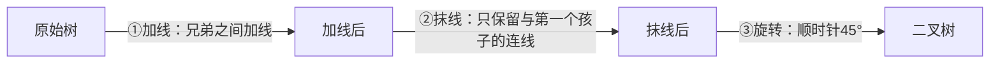

**记忆口诀**：左孩子右兄弟（树的第一个孩子作为二叉树的左孩子，兄弟关系变成右子树）

**重要性质**：树转二叉树后，根节点右子树总是为空。

#### 二叉树 → 树（逆过程）

1. 以根节点为轴心，**逆时针**旋转 45°
2. 抹去每棵树上兄弟节点之间的连线
3. 将二叉树转换成相应的树

### 1.3 森林与二叉树的转换

#### 森林 → 二叉树

1. 将森林中的**每棵树**转换成二叉树
2. **每棵树的根节点视为兄弟节点**，在各树之间加一条连线
3. 以第一棵树的树根为轴心，顺时针旋转 45°

### 1.4 树的遍历

| 树的遍历 | 规则 | 对应二叉树的遍历 |
|---------|------|----------------|
| 先根遍历 | 根 → 子树（从左到右） | 先序遍历 |
| 后根遍历 | 子树（从左到右） → 根 | 中序遍历 |

### 1.5 森林的遍历

| 森林的遍历 | 对应二叉树的遍历 |
|-----------|-----------------|
| 先序遍历 | 先序遍历 |
| 中序遍历 | 中序遍历 |

---

## 2. 二叉排序树（BST）

### 2.1 定义

又称**二叉查找树**，满足：
- 左子树非空时，左子树上所有节点的值 **< 根节点的值**
- 右子树非空时，右子树上所有节点的值 **> 根节点的值**
- 左右子树本身也是二叉排序树

### 2.2 性质

> **对二叉排序树进行中序遍历，得到的序列是有序序列（升序）**

### 2.3 插入操作

```
如果树为空 → 直接插入作为根节点
如果树非空：
    比较关键字和根节点大小
    小于根节点 → 插入左子树
    大于根节点 → 插入右子树
```

**注意**：新插入的节点一定是**叶子节点**

### 2.4 删除操作

| 情况 | 处理方法 |
|-----|---------|
| 叶子节点 | 直接删除 |
| 只有左子树或右子树 | 用该子树顶替被删除节点的位置 |
| 同时有左右子树 | 用直接后继（或直接前驱）代替，然后删除后继/前驱 |

**直接后继**：中序遍历序列中该节点的下一个节点（即右子树中的最左节点）

**直接前驱**：中序遍历序列中该节点的上一个节点（即左子树中的最右节点）

---

## 3. 哈夫曼树（重点）

### 3.1 基本概念

| 术语 | 含义 |
|-----|-----|
| **权** | 树中节点被赋予的代表某种意义的数值 |
| **节点的带权路径长度** | 从树的根到该节点的路径长度 × 该节点的权值 |
| **树的带权路径长度(WPL)** | 所有**叶子节点**的带权路径长度之和 |
| **哈夫曼树** | 带权路径长度最小的二叉树（最优二叉树） |

### 3.2 构造哈夫曼树

**算法步骤**：

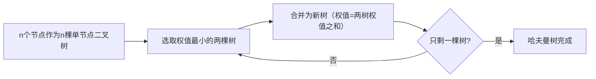

> **注意**：左子树根节点权值 ≤ 右子树根节点权值

### 3.3 哈夫曼编码

**编码规则**：
- 左孩子路径标记为 **0**
- 右孩子路径标记为 **1**
- 从根到节点的路径即为该字符的编码

**特点**：权值越大的字符，编码越短，实现数据压缩。哈夫曼编码是**前缀编码**，无二义性。

### 3.4 求WPL

$$WPL = \sum_{i=1}^{n} w_i \times l_i$$

其中 $w_i$ 为叶子节点权值，$l_i$ 为该节点到根的边数。

---

## 典型例题汇总

### 题型1：树的遍历对应关系

**题目**：树的先根遍历等于对应二叉树的什么遍历？

**答案**：先序遍历

---

### 题型2：森林的遍历对应关系

**题目**：森林的中序遍历等于对应二叉树的什么遍历？

**答案**：中序遍历

---

### 题型3：二叉排序树中序遍历

**题目**：对二叉排序树进行什么遍历可以得到有序序列？

**答案**：中序遍历（升序）

---

### 题型4：哈夫曼树性质

**题目**：哈夫曼树中是否存在度为1的节点？

**答案**：不存在（哈夫曼树无度为1的节点）

---

## 常见考点速记

### 转换与遍历对应表

| 原始结构 | 遍历方式 | 对应二叉树遍历 |
|---------|---------|---------------|
| 树 | 先根遍历 | 先序遍历 |
| 树 | 后根遍历 | 中序遍历 |
| 森林 | 先序遍历 | 先序遍历 |
| 森林 | 中序遍历 | 中序遍历 |

### 哈夫曼树核心

```
WPL = Σ(权值 × 路径长度)
构造：每次选最小的两个合并
编码：左0右1，前缀编码
性质：无度为1的节点
```

---

# P8 图

## 1. 图的基本概念

### 1.1 有向图与无向图

| 类型 | 表示 | 说明 |
|------|------|------|
| **有向图** | $\langle V,W \rangle$ | 每条边都有方向 |
| **无向图** | $(V,W)$ | 所有边都没有方向，V和W可互换 |

### 1.2 简单图与多重图

**简单图需满足两个条件**：
- 不能存在重复边
- 不能存在顶点到自身的边（无自环）

**多重图**：存在重复边或顶点到自身边的图。

### 1.3 完全图

| 图的类型 | 定义 | 边数公式 |
|---------|------|---------|
| 无向完全图 | 任意两个顶点之间都存在边 | $\frac{n(n-1)}{2}$ |
| 有向完全图 | 任意两个顶点之间存在方向相反的两条弧 | $n(n-1)$ |

### 1.4 子图与生成子图

- **子图**：顶点集合和边集合都是原图的子集
- **生成子图（生成树）**：顶点集合等于原图的顶点集合
  - 边数 = 顶点数 - 1

### 1.5 连通与连通图

- **连通**：两个顶点之间存在路径连接
- **连通图**：图中任意两个顶点都是连通的
- **极小连通子图**：既是连通图，同时边数最少（去掉任一条边就不连通）

### 1.6 顶点的度、入度和出度

#### 无向图

- **度**：与该顶点相连的边的数目
- **握手定理**：$\sum \text{全部顶点度数} = \text{边数} \times 2$

#### 有向图

- **入度**：以该顶点为终点的有向边数目
- **出度**：以该顶点为起点的有向边数目
- **度**：入度 + 出度
- **性质**：$\sum \text{入度} = \sum \text{出度} = \text{边数}$

### 1.7 边的权和网

在图的每条边上加上相应的数值，这个数值称为**权**，带有权的图称为**带权图**或**网**。

### 1.8 路径与回路

- **路径**：从一个顶点到另一个顶点所经过的顶点序列
- **路径长度**：路径上边的数目
- **回路（环）**：第一个顶点和最后一个顶点相同的路径

---

## 2. 图的存储结构

### 2.1 邻接矩阵法

邻接矩阵是一个 $n \times n$ 的矩阵（$n$ 为顶点数）。

#### 无向图的邻接矩阵

$\text{若边 }(V_i,V_j)\text{ 存在，则 } matrix[i][j] = matrix[j][i] = 1$

**特点**：矩阵关于主对角线对称

#### 有向图的邻接矩阵

$\text{若存在从 }V_i\text{ 到 }V_j\text{ 的有向边，则 } matrix[i][j] = 1$

**特点**：不关于主对角线对称

#### 带权图的邻接矩阵

$\text{若边 }(V_i,V_j)\text{ 存在，则 } matrix[i][j] = \text{该边的权值}$

$\text{若边不存在，则 } matrix[i][j] = 0 \text{ 或 } \infty$

#### 存储空间分析

**重要结论**：邻接矩阵所占用的存储空间大小只与**顶点的个数**有关，与**边的条数无关**。

- $n$ 个顶点的图，邻接矩阵为 $n \times n$，共 $n^2$ 个元素

### 2.2 邻接表法

邻接表由两种节点组成：

| 节点类型 | 组成 | 作用 |
|---------|------|------|
| 顶点表节点 | 顶点域 + 边表头指针 | 存储顶点信息 |
| 边表节点 | 邻接点域 + 指针域 | 存储与该顶点相邻的边 |

#### 存储空间

| 图类型 | 存储空间 |
|--------|---------|
| 无向图 | $V + 2E$ |
| 有向图 | $V + E$ |

#### 邻接表特点总结

| 特点 | 说明 |
|-----|------|
| 适用场景 | 稀疏图（边较少时节省空间）；稠密图宜用邻接矩阵 |
| 边表顺序 | 同一顶点邻接点的顺序不唯一 |
| 求出度 | 只需统计该顶点边表节点的个数 |
| 求入度 | 需要遍历整个顶点表和所有边表（较费时间） |

---

## 3. 图的遍历

### 3.1 广度优先搜索（BFS）

**核心思想**：类似于二叉树的层次遍历，先访问起点的所有邻接点，再依次访问邻接点的邻接点。

**数据结构**：使用**辅助队列**

**重要性质**：BFS遍历序列**不唯一**

### 3.2 深度优先搜索（DFS）

**核心思想**：类似于树的先序遍历，沿着一条路走到底，走不通再回溯。

**数据结构**：使用**栈**

**重要性质**：
- DFS遍历序列**不唯一**
- 对于连通图，从任意顶点出发进行一次DFS，就可以访问所有顶点

### 3.3 BFS 与 DFS 对比

| 对比项 | BFS | DFS |
|-------|-----|-----|
| 类似遍历 | 层次遍历 | 先序遍历 |
| 使用数据结构 | 队列 | 栈 |
| 序列唯一性 | 不唯一 | 不唯一 |

---

## 典型例题汇总

### 题型1：握手定理

**题目**：$n$ 个顶点的无向连通图，邻接矩阵中至少有多少个非零元素？

**解析**：连通图最少边数 $= n-1$，每条边需要表示两次 → 非零元素至少为 $2(n-1)$

---

### 题型2：邻接表存储空间

**题目**：$N$ 个顶点、$E$ 条边的无向图，邻接表中有多少个头节点和表节点？

**解析**：头节点 = $N$，表节点 = $2E$

---

### 题型3：DFS与连通性

**题目**：从一个无向图的任意顶点出发进行一次深度优先搜索，就可以访问所有顶点，则该图一定是？

**答案**：**连通图**

---

## 常见考点速记

### 核心公式汇总

| 概念 | 公式 |
|-----|------|
| 无向完全图边数 | $\frac{n(n-1)}{2}$ |
| 有向完全图边数 | $n(n-1)$ |
| 生成树边数 | $n - 1$ |
| 无向图度数之和 | $2E$ |
| 有向图入度/出度之和 | $E$ |
| 无向图邻接表存储空间 | $V + 2E$ |
| 有向图邻接表存储空间 | $V + E$ |
| 邻接矩阵存储空间 | $n^2$ |

### 握手定理

- **无向图**：度数之和 = 边数的两倍
- **有向图**：入度之和 = 出度之和 = 边数

---

# P9 图的应用

## 1. 最小生成树

### 1.1 概念定义

**最小生成树（MST）**：带权连通无向图中所有生成树中权值最小的那棵生成树。

**关键性质**：
- 边数 = 顶点数 - 1
- 当图中所有边权值相等时，最小生成树不唯一
- 当图中所有边权值都不相等时，最小生成树唯一

### 1.2 Prim算法（选点法）

**核心思想**：从某个顶点开始，每次选择与当前顶点集合距离最近且不产生回路的顶点及边加入。

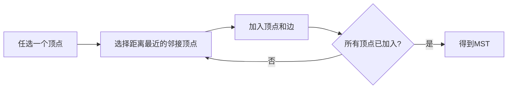

**时间复杂度**：$O(V^2)$，适用于**稠密图**

### 1.3 Kruskal算法（选边法）

**核心思想**：每次选择当前权值最小且不产生回路的边加入。

**时间复杂度**：$O(E \log E)$，适用于**稀疏图**

### 1.4 两种算法对比

| 特征 | Prim算法 | Kruskal算法 |
|------|----------|-------------|
| 选择方式 | 选择顶点 | 选择边 |
| 适用场景 | 稠密图 | 稀疏图 |
| 时间复杂度 | $O(V^2)$ | $O(E \log E)$ |

---

## 2. 最短路径

### 2.1 概念定义

**最短路径**：带权图中从一个源点到其他各顶点的权值最小的路径。

### 2.2 Dijkstra算法（迪杰斯特拉算法）

**核心思想**：贪心算法，逐步扩展已求得最短路径的顶点集合。

**核心概念**：
- 一个顶点到自身的距离设为 **0**
- 两个顶点不相邻时，距离为 **正无穷**（$\infty$）

**算法步骤**：

| 步骤 | 操作 |
|------|------|
| 1 | 构造集合 S（已求得最短路径）、T（未求得） |
| 2 | 初始：S为空，源点到自身=0，到其他顶点=$\infty$ |
| 3 | 从T中选择当前距离最小的顶点v，加入S |
| 4 | 从v出发，更新其相邻顶点的距离（若经过v更短则更新） |
| 5 | 重复步骤3-4，直至所有顶点加入S |

---

## 3. 拓扑排序

### 3.1 基本概念

**AOV网**（Activity On Vertex network）：
- 用**顶点**表示活动
- 有向边 $\langle V_i, V_j \rangle$ 表示活动 $V_i$ 必须在活动 $V_j$ 之前进行

**拓扑排序**：
- 每个顶点出现且仅出现一次
- 若存在从顶点A到顶点B的路径，则拓扑序列中B一定出现在A后面

### 3.2 算法步骤

| 步骤 | 操作 |
|------|------|
| 1 | 从AOV网中选择一个**没有前驱**的顶点并输出 |
| 2 | 删除该顶点及其所有以它为起点的有向边 |
| 3 | 重复步骤1-2，直至网为空或不存在无前驱的顶点 |

---

## 4. 关键路径

### 4.1 基本概念

**AOE网**（Activity On Edge network）：
- **顶点**表示事件
- **有向边**表示活动
- **边上的权值**表示完成该活动的开销

### 4.2 AOV网与AOE网的区别

| 特征 | AOV网 | AOE网 |
|------|-------|-------|
| 顶点表示 | 活动 | 事件 |
| 边表示 | 活动之间的优先级关系 | 活动及其所需时间 |
| 边上权值 | 无 | 有（表示活动耗时） |

### 4.3 关键参量

| 参量 | 符号 | 计算方法 |
|------|------|----------|
| 事件最早发生时间 | $Ve[k]$ | 源点=0，从前往后取最长路径 |
| 事件最迟发生时间 | $Vl[k]$ | 汇点=Ve[汇点]，从后往前取最小值 |
| 活动最早开始时间 | $e[i]$ | $e(i) = Ve(\text{活动起点})$ |
| 活动最迟开始时间 | $l[i]$ | $l(i) = Vl(\text{活动终点}) - w$ |
| 时间余量 | $d[i]$ | $d(i) = l(i) - e(i)$ |

**关键活动判定**：当 $d(i) = 0$ 时，该活动为关键活动。

**关键路径**：从开始顶点（源点）到结束顶点（汇点）所有路径中**具有最大路径长度**的那条路径。

### 4.4 求解步骤

| 步骤 | 操作 |
|------|------|
| 1 | 求各顶点的**最早发生时间** $Ve$ |
| 2 | 求各顶点的**最迟发生时间** $Vl$ |
| 3 | 求各**活动**的最早开始时间 $e$ |
| 4 | 求各**活动**的最迟开始时间 $l$ |
| 5 | 求各活动的时间余量 $d(i) = l(i) - e(i)$ |
| 6 | $d(i) = 0$ 的活动即为**关键活动** |

### 4.5 重要结论

1. 求顶点的时间参量（$Ve$、$Vl$）：需要比较取最大/最小值
2. 求活动的时间参量（$e$、$l$）：直接使用对应顶点的值，不需要比较
3. 关键路径一定是最大路径长度
4. 一个工程可能有多条关键路径

---

## 典型例题汇总

### 题型1：最小生成树唯一性

**题目**：当图中所有权值都不相等时，最小生成树是否唯一？

**答案**：唯一

---

### 题型2：拓扑排序序列

**题目**：拓扑排序的结果是否唯一？

**答案**：可能不唯一

---

### 题型3：关键路径判断

**题目**：关键路径的路径长度在图的所有路径中是什么类型？

**答案**：最大路径长度

---

## 常见考点速记

### 图的应用核心算法

| 考点 | 核心算法 | 关键特征 |
|------|----------|----------|
| 最小生成树 | Prim / Kruskal | 边数 = 顶点数 - 1 |
| 最短路径 | Dijkstra | 贪心，不能处理负权边 |
| 拓扑排序 | AOV网 | 无前驱顶点优先输出 |
| 关键路径 | AOE网 | 取最长路径，找 $d(i)=0$ 的活动 |

### 时间参量记忆

```
Ve：从前往后，取MAX
Vl：从后往前，取MIN
e(i) = Ve(起点)
l(i) = Vl(终点) - w
关键活动：d(i) = 0

---

# P10 查找

## 1. 查找的基本概念

### 1.1 定义

| 术语 | 定义 |
|------|------|
| **查找** | 在数据集合中寻找满足某种条件的数据元素的过程 |
| **查找表** | 用于查找的数据集合 |
| **关键字** | 数据元素中某个数据项的值，用于标识一个数据元素 |
| **主关键字** | 可以唯一标识一条记录的关键字 |

### 1.2 平均查找长度（ASL）

所有查找过程中进行关键字比较次数的平均值。

$$ASL = \sum_{i=1}^{n} P_i \cdot C_i$$

| 符号 | 含义 |
|------|------|
| $P_i$ | 查找第 $i$ 个元素的概率，通常为 $\frac{1}{N}$（等概率） |
| $C_i$ | 找到第 $i$ 个元素所需的比较次数 |

---

## 2. 顺序查找

### 2.1 基本思想

从线性表的一端开始，逐个检查关键字是否满足给定条件。

### 2.2 算法实现（含哨兵）

```c
int Search_Seq(SSTable ST, KeyType K) {
    ST.elem[0] = K;           // 哨兵：把关键字放到0号位置
    for (i = ST.length; ST.elem[i] != K; --i);  // 从后往前查找
    return i;                 // 返回位置，i=0时表示查找失败
}
```

**哨兵的作用**：
- 避免循环中判断数组越界
- 提高程序执行效率

### 2.3 时间复杂度

- 查找成功的平均查找长度 = $\frac{N+1}{2}$
- 查找失败的平均查找长度 = $N+1$

> **重要结论**：线性链表只能进行顺序查找

---

## 3. 折半查找（二分查找）

### 3.1 适用条件

- **有序**的顺序表
- 必须同时满足"有序"和"顺序表"两个条件

### 3.2 算法思想

设置三个指针：`low`（下界）、`high`（上界）、`mid`（中间位置）

每次取中间元素与关键字比较：
- 相等：查找成功
- 关键字 < 中间元素：在左半区继续查找（`high = mid - 1`）
- 关键字 > 中间元素：在右半区继续查找（`low = mid + 1`）

### 3.3 算法实现

```c
int Search_Bin(SSTable L, KeyType K) {
    int low = 0;
    int high = L.length - 1;
    int mid;
    
    while (low <= high) {
        mid = (low + high) / 2;  // 向下取整
        
        if (L.elem[mid] == K)
            return mid;
        else if (L.elem[mid] > K)
            high = mid - 1;      // 在左半区查找
        else
            low = mid + 1;       // 在右半区查找
    }
    return -1;  // 查找失败
}
```

### 3.4 判定树

将折半查找过程用二叉树表示：
- 根节点：第一次mid位置
- **圆形结点**：查找成功
- **方形结点**：查找失败（叶子结点）

### 3.5 平均查找长度

对于**满二叉树**情况：

$ASL_{\text{成功}} \approx \log_2(N+1) - 1$

**时间复杂度**：$O(\log_2 N)$

---

## 4. 散列表（哈希表）

### 4.1 基本概念

| 术语 | 定义 |
|------|------|
| **散列存储** | 根据元素的关键字直接计算出存储地址 |
| **散列函数** | $H(key)$，将关键字映射为对应地址 |
| **同义词** | 不同关键字经散列函数映射到同一地址 |
| **冲突** | 散列函数将不同关键字映射到同一地址的现象 |

### 4.2 常见散列函数

#### 直接定址法

$H(key) = a \times key + b$

#### 除留余数法（最常用）

$H(key) = key \bmod p$

其中 $p$ 为不大于且最接近或等于 $m$（表长）的质数。

### 4.3 解决冲突的方法

#### 开放地址法

递推公式：

$H_i = (H(key) + d_i) \bmod m$

三种探测法：

| 方法 | 增量序列 $d_i$ |
|------|----------------|
| **线性探测法** | $0, 1, 2, 3, \dots, m-1$ |
| **平方探测法** | $0^2, 1^2, -1^2, 2^2, -2^2, \dots, k^2, -k^2$ |
| **再散列法** | $d_i = H_2(key)$ |

#### 拉链法（链地址法）

把所有同义词存储在一个链表中。

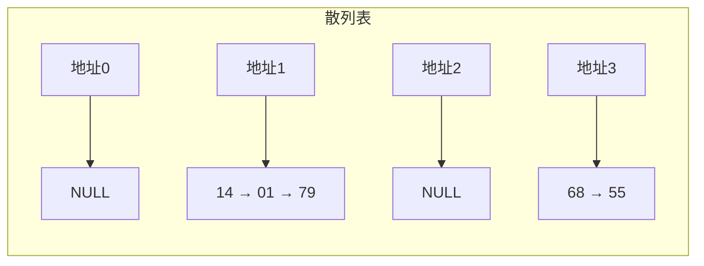

### 4.4 平均查找长度计算

#### 查找成功的ASL

$ASL_{\text{成功}} = \frac{\sum\text{比较次数}}{\text{元素个数}}$

#### 查找不成功的ASL

$ASL_{\text{不成功}} = \frac{\sum\text{比较次数}}{\text{散列后的地址个数}(p)}$

### 4.5 装填因子

$$\alpha = \frac{n}{m}$$

| 符号 | 含义 |
|------|------|
| $n$ | 表中的记录数 |
| $m$ | 散列表的长度 |

**重要结论**：
- 平均查找长度取决于装填因子 $\alpha$，而不是直接取决于 $n$ 或 $m$
- $\alpha$ 越大，冲突可能性越大

---

## 5. 各查找方法对比

| 查找方法 | 适用结构 | 时间复杂度 | 特点 |
|----------|----------|------------|------|
| 顺序查找 | 顺序表、链表 | $O(n)$ | 对结构无要求，简单但效率低 |
| 折半查找 | 有序顺序表 | $O(\log_2 n)$ | 效率高，但需有序且是顺序存储 |
| 二叉排序树 | 二叉树 | $O(\log_2 n) \sim O(n)$ | 动态查找，支持插入删除 |
| 散列表 | 散列存储 | $O(1)$（理想情况） | 查找效率高，但有冲突问题 |

---

## 典型例题汇总

### 题型1：顺序查找ASL

**题目**：长度为 $n$ 的顺序表，顺序查找成功的平均查找长度？

**答案**：$\frac{n+1}{2}$

---

### 题型2：折半查找适用条件

**题目**：折半查找适用于什么结构？

**答案**：有序的顺序表

---

### 题型3：散列表装填因子

**题目**：散列表的平均查找长度取决于什么？

**答案**：装填因子 $\alpha = n/m$

---

## 常见考点速记

### 查找算法对比

```
顺序查找：O(n)，不要求有序
折半查找：O(log₂n)，必须有序顺序表
散列表：O(1)理想情况，取决于装填因子
```

### 散列表核心公式

```
除留余数法：H(key) = key mod p
开放地址法：Hᵢ = (H(key) + dᵢ) mod m
装填因子：α = n/m
拉链法：同义词存入链表

---

# P11 排序（1）

## 1. 排序的基本概念

### 1.1 排序的定义

**排序**：重新排列表中的元素，使表中的元素满足关键字有序（通常采用升序）。

### 1.2 稳定性

对于待排序的表中有两个元素 $R_i$ 和 $R_j$：
- 关键字相同
- 排序之前 $R_i$ 在 $R_j$ 前面

经过排序算法后，若 $R_i$ 依然在 $R_j$ 前面（相对位置保持不变），则称该排序算法是**稳定**的。

### 1.3 内部排序与外部排序

| 类型 | 定义 |
|------|------|
| **内部排序** | 排序期间元素全部存放到内存中 |
| **外部排序** | 排序期间元素无法同时存放到内存，需要内外存数据交换 |

**内部排序的分类**：

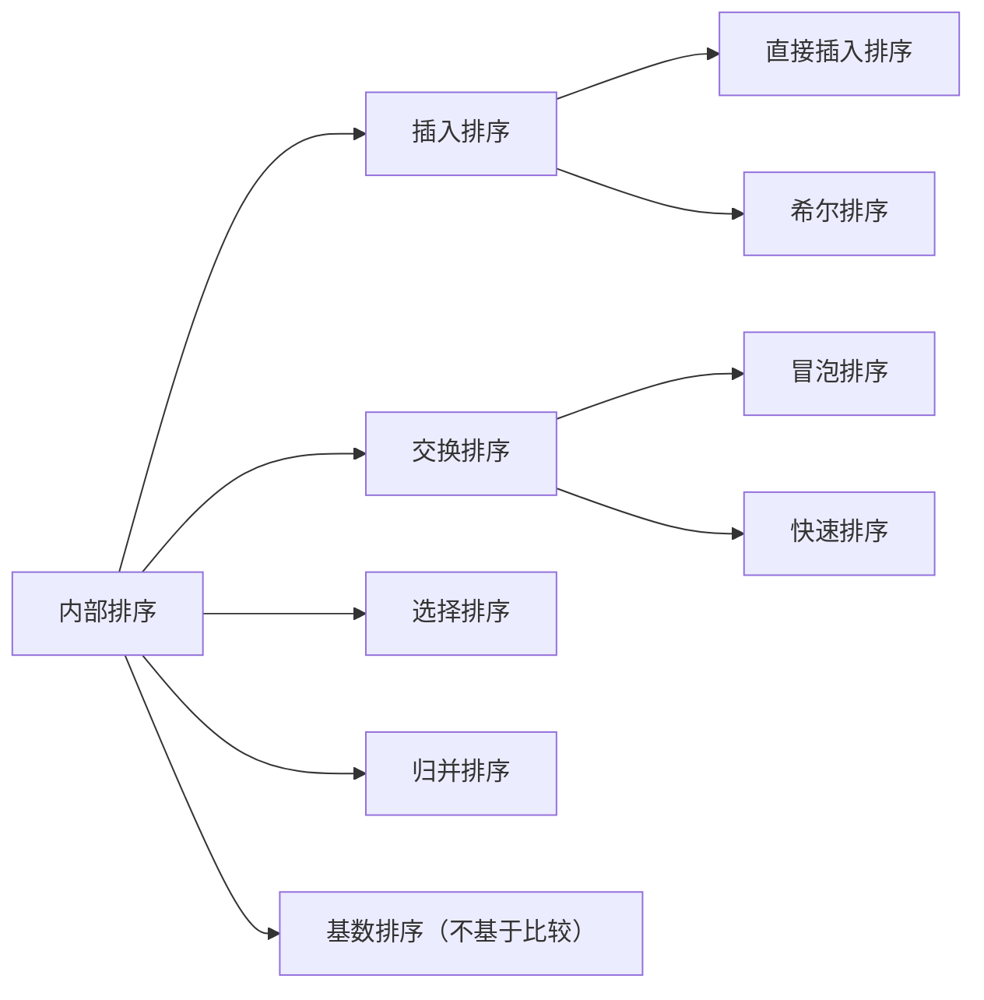

---

## 2. 插入排序

### 2.1 直接插入排序

#### 基本思想

每次将一个待排序的记录，按照关键字的大小插入到前面已排好序的子序列中，直到全部记录插入完成。

**$N$ 个元素需要经过 $N-1$ 趟直接插入排序。**

#### 代码实现

```c
void InsertSort(int A[], int N) {
    int i, j;
    for (i = 1; i < N; i++) {  // i对应排序的趟数，共N-1趟
        int temp = A[i];       // 暂存待排序元素
        for (j = i - 1; j >= 0 && temp < A[j]; --j) {
            A[j + 1] = A[j];   // 元素后移，腾出插入位置
        }
        A[j + 1] = temp;       // 插入元素
    }
}
```

#### 算法特性

| 特性 | 分析 |
|------|------|
| **空间效率** | 空间复杂度 $O(1)$ |
| **时间效率** | 时间复杂度 $O(n^2)$（平均情况） |
| **稳定性** | **稳定** |

### 2.2 希尔排序

#### 基本思想

1. 把相隔某个**增量**的记录组成一个子表
2. 对每个子表分别进行直接插入排序
3. 当整个表中的元素基本有序时，再对整个表进行一次直接插入排序

> 希尔排序是基于直接插入排序的**优化算法**。

#### 算法特性

| 特性 | 分析 |
|------|------|
| **空间效率** | 空间复杂度 $O(1)$ |
| **时间效率** | 依赖于增量选择，**时间复杂度不能确定** |
| **稳定性** | **不稳定** |

> **记忆技巧**：初始排序算法一般是稳定的，优化后的算法往往是不稳定的。

---

## 3. 交换排序

### 3.1 冒泡排序

#### 基本思想

从后往前（或从前往后）两两比较相邻元素的值，若为**逆序**则发生交换，直到序列比较完毕。

**$N$ 个元素需要 $N-1$ 趟冒泡排序。**

#### 代码实现

```c
void BubbleSort(int A[], int N) {
    for (int i = 0; i < N - 1; i++) {  // i对应排序的趟数
        int flag = 0;  // 标志位，记录本趟是否发生交换
        for (int j = N - 1; j > i; --j) {  // 从后往前比较
            if (A[j] < A[j - 1]) {
                swap(A[j], A[j - 1]);
                flag = 1;
            }
        }
        if (flag == 0)  // 本趟未发生交换，说明已有序
            return;
    }
}
```

#### 算法特性

| 特性 | 分析 |
|------|------|
| **空间效率** | 空间复杂度 $O(1)$ |
| **时间效率** | 最好 $O(n)$（已有序），最坏 $O(n^2)$（逆序） |
| **稳定性** | **稳定** |

### 3.2 快速排序

#### 基本思想

1. 在表中任取一个元素作为**枢轴**（通常取首元素）
2. 通过一趟排序，将表划分为两个独立的部分：
   - 左部分：所有元素 **小于** 枢轴
   - 右部分：所有元素 **大于等于** 枢轴
3. 递归地对左右两部分进行快速排序

> 快速排序是对冒泡排序的**优化**。

#### 算法特性

| 特性 | 分析 |
|------|------|
| **空间效率** | 使用递归栈，空间复杂度 $O(\log_2 n)$ |
| **时间效率** | 平均 $O(n \log_2 n)$，最坏 $O(n^2)$ |
| **稳定性** | **不稳定** |

#### 快速排序的重要结论

1. **平均性能最优**：快速排序是所有排序算法中平均性能最优的
2. **不适用于基本有序的序列**：原本有序或基本有序会导致最坏情况
3. 每趟排序都会把枢轴元素放到**最终位置**
4. C++ 的 `sort()` 函数底层就是快速排序

---

## 典型例题汇总

### 题型1：稳定性判断

**题目**：内部排序方法的稳定性，是指这个排序算法不允许有相同的关键字记录。

**答案**：错误（稳定性是指相同关键字的相对位置是否保持不变）

---

### 题型2：冒泡排序交换次数

**题目**：对于 $N$ 个不同的关键字，从小到大进行冒泡排序，在哪种情况下交换次数最多？

**答案**：关键字序列从大到小逆序

---

### 题型3：快速排序特点

**题目**：关于快速排序的说法，正确的是？

**答案**：快速排序是所有内部排序方法中平均性能最优的

---

## 常见考点速记

### 排序算法对比（第一组）

| 排序算法 | 空间复杂度 | 时间复杂度（平均） | 稳定性 |
|----------|------------|-------------------|--------|
| 直接插入排序 | $O(1)$ | $O(n^2)$ | 稳定 |
| 希尔排序 | $O(1)$ | 不确定 | **不稳定** |
| 冒泡排序 | $O(1)$ | $O(n^2)$ | 稳定 |
| 快速排序 | $O(\log_2 n)$ | **$O(n \log_2 n)$** | **不稳定** |

---

# P12 排序（2）

## 1. 选择排序

### 1.1 简单选择排序

#### 基本思想

第 $i$ 趟排序从下标为 $i$ 到 $n$ 的关键字中选取关键字最小的元素，与 $L[i]$ 进行交换。经过 $n-1$ 趟排序后，所有元素有序。

```c
void SelectSort(int arr[], int n) {
    for (int i = 0; i < n - 1; i++) {
        int min = i;
        for (int j = i + 1; j < n; j++) {
            if (arr[j] < arr[min]) {
                min = j;
            }
        }
        if (min != i) {
            int temp = arr[i];
            arr[i] = arr[min];
            arr[min] = temp;
        }
    }
}
```

#### 算法特性

| 特性 | 结论 |
|------|------|
| **空间效率** | 空间复杂度 $O(1)$ |
| **时间效率** | 时间复杂度 $O(n^2)$ |
| **稳定性** | **不稳定** |

### 1.2 堆排序

#### 堆的定义

| 类型 | 定义 |
|------|------|
| **小根堆** | 根结点值最小，每个双亲都比孩子小 |
| **大根堆** | 根结点值最大，每个双亲都比孩子大 |

堆可以看作是用**顺序存储**方式存储的二叉树。

#### 构造大根堆

**关键步骤**：从最后一个分支节点开始，从后往前、从下往上进行调整。

**公式**：最后一个分支节点的编号 $= \lfloor n/2 \rfloor$

**调整方法**：比较双亲结点与孩子结点，若双亲较小，则将其与较大的孩子交换，递归向下调整。

#### 堆的删除与插入

- **删除堆顶**：将最后一个元素与堆顶交换 → 从堆顶向下调整
- **插入新节点**：插入末端 → 从该节点向上调整

#### 堆排序算法特性

| 特性 | 结论 |
|------|------|
| **空间效率** | 空间复杂度 $O(1)$ |
| **时间效率** | 时间复杂度 $O(n \log_2 n)$ |
| **稳定性** | **不稳定** |

> **简单选择排序和堆排序都是不稳定的算法**

---

## 2. 归并排序

### 2.1 归并的含义

将两个或两个以上的有序表组合成一个新的有序表。通常采用**二路归并排序**。

### 2.2 二路归并排序过程

- **初始状态**：每个关键字视为一个有序表
- **每趟归并**：相邻两个有序表归并
- 重复直到所有元素有序

### 2.3 算法特性

| 特性 | 结论 |
|------|------|
| **空间效率** | 需要辅助空间，空间复杂度 **$O(n)$**（所有内部排序中最高） |
| **时间效率** | 时间复杂度 $O(n \log_2 n)$ |
| **稳定性** | **稳定** |

---

## 3. 基数排序

### 3.1 基本思想

基数排序是**不基于比较和移动**的排序算法，而是**基于关键字各位的大小**进行排序。

采用**分配**和**收集**两种操作：
- **分配**：按当前位将关键字分配到相应的队列（0~9）
- **收集**：按队列顺序收集所有关键字

### 3.2 算法特性

| 特性 | 结论 |
|------|------|
| **空间效率** | 与基数 $r$ 有关，空间复杂度 $O(r)$ |
| **时间效率** | $O(d(n+r))$，其中 $d$ 为位数，$r$ 为基数 |
| **稳定性** | **稳定** |

---

## 4. 各种内部排序算法的比较

### 汇总表

| 排序算法 | 类别 | 空间复杂度 | 时间复杂度 | 稳定性 |
|---------|------|-----------|-----------|--------|
| 直接插入排序 | 插入类 | $O(1)$ | $O(n^2)$ | 稳定 |
| 希尔排序 | 插入类 | $O(1)$ | 不确定 | 不稳定 |
| 冒泡排序 | 交换类 | $O(1)$ | $O(n^2)$ | 稳定 |
| 快速排序 | 交换类 | $O(\log_2 n)$ | $O(n \log_2 n)$ | 不稳定 |
| **简单选择排序** | 选择类 | $O(1)$ | $O(n^2)$ | **不稳定** |
| **堆排序** | 选择类 | $O(1)$ | $O(n \log_2 n)$ | **不稳定** |
| **归并排序** | 归并类 | **$O(n)$** | $O(n \log_2 n)$ | **稳定** |
| **基数排序** | 分配类 | $O(r)$ | $O(d(n+r))$ | **稳定** |

### 重点结论

1. 简单选择排序和堆排序都是**不稳定**的
2. 归并排序需要 $O(n)$ 的辅助空间（所有内部排序中空间复杂度最高）
3. 快速排序不适用于原本有序或基本有序的记录
4. 堆排序和归并排序的时间复杂度最坏情况下仍为 $O(n \log_2 n)$

---

## 典型例题汇总

### 题型1：基本有序数据的排序选择

**题目**：在直接插入排序和快速排序中，如果初始数据基本有序，应采用哪种方法？

**答案**：直接插入排序（快速排序对基本有序数据会退化为 $O(n^2)$）

---

### 题型2：稳定性要求下的排序选择

**题目**：在冒泡排序和堆排序中，如果要求数据稳定，应采用哪种方法？

**答案**：冒泡排序（堆排序不稳定）

---

### 题型3：空间复杂度比较

**题目**：下列四种算法中，需要附加内存空间最大的是？

- A. 插入排序
- B. 选择排序
- C. 快速排序
- D. 归并排序

**答案**：D. 归并排序（$O(n)$）

---

### 题型4：一趟排序后元素位置确定

**题目**：一趟排序结束后，不一定能够选出一个元素放在最终位置上的是哪个算法？

**答案**：希尔排序

**解析**：
- 简单选择/冒泡：每趟选出最小/最大元素放在最终位置
- 快速排序：枢轴元素放在最终位置
- 希尔排序：每趟排序后不一定有元素在最终位置

---

### 题型5：堆的判定

**题目**：判断给定序列是否为堆，将序列按顺序存储方式构成二叉树后检查双亲与孩子关系。

---

## 常见考点速记

### 稳定 vs 不稳定

| 稳定性 | 排序算法 |
|--------|----------|
| **稳定** | 直接插入排序、冒泡排序、归并排序、基数排序 |
| **不稳定** | 希尔排序、快速排序、简单选择排序、堆排序 |

### 时间复杂度速记

```
O(n²)：直接插入、冒泡、简单选择
O(n log₂ n)：快速（平均）、归并、堆
不确定：希尔排序
O(d(n+r))：基数排序
```

### 空间复杂度速记

```
O(1)：直接插入、希尔、冒泡、简单选择、堆
O(log₂ n)：快速排序（递归栈）
O(n)：归并排序（最高）
O(r)：基数排序
```
